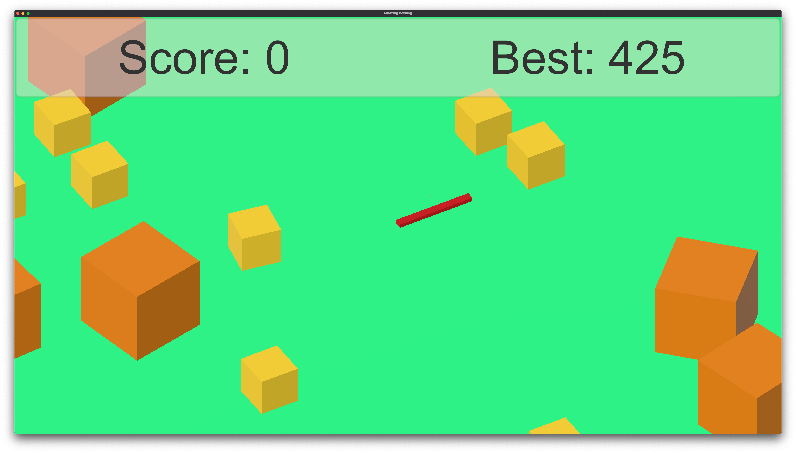
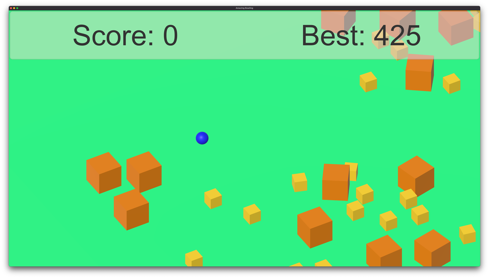
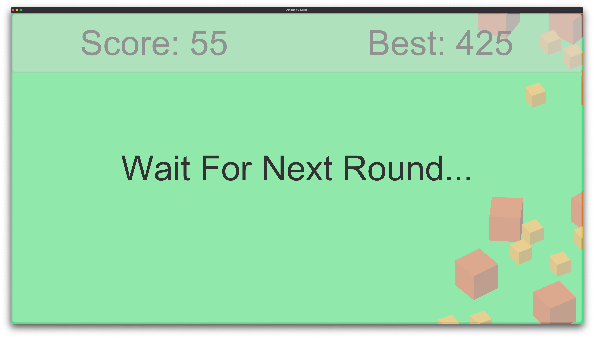

# Amazing Bowling

## ABOUT THIS GAME (게임 설명)

포신을 회전 시켜 각도를 조절하고, 발사 세기를 조절해 포를 발사한다.

포탄의 폭발을 이용해 상자를 파괴시키면 점수를 얻는다.

- 작은 상자: 5점
- 큰 상자: 10점

`Amazing_Bowling.app` 파일은 `Mac OS` 에서 동작한다.

---

Spin cannon, adjust shooting power and shoot the cannon.

You get point If boxes destroyed by cannon ball explosion.

- Small Box: 5 Points
- Big Box: 10 Points

`Amazing_Bowling.app` file runs on `Mac OS`.

## GAME CONTROLS (조작법)

- `마우스 왼쪽 버튼 꾹 누르기` :
  1. 포신의 좌우 회전
  2. 포신의 상하 회전
  3. 포탄의 발사 세기 조절

---

- `Pushing Down Left Mouse Button` :
  1. Spin cannon left to right
  2. Spin cannon down to up
  3. Control shooting power

## GAME PLAY SCREENSHOTS (스크린샷)

